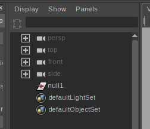
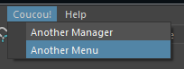

# Maya Code Snippet

## Retrieve position of every vertices of mesh node

Very fast way to retrieve position of every vertices of mesh node.

```python
import maya.cmds as mc

raw_pos = mc.xform('pCube1.vtx[*]', query = True, worldSpace = True, translation = True)
vtx_pos = zip(raw_pos[0::3], raw_pos[1::3], raw_pos[2::3])
```

## Retrive index of the closest vertex of the given position

```python
def sqrt_dst(p1,p2):
    """return square distance between `p1` and `p2`
    
    This assume `p1` and `p2` are tuple of three component each.
    """
    return (p1[0]-p2[0])**2+(p1[1]-p2[1])**2+(p1[2]-p2[2])**2

def closest(org_pos, node):
    """Return vertex indice of given node wich is the closest of given world space `org_pos`"""
    # get every world space position of given node vertices
    raw_pos = cmds.xform(node+'.vtx[*]', query = True, worldSpace = True, translation = True)
    
    # convert raw list to list of three-component-tuple
    pt_pos = zip(raw_pos[0::3], raw_pos[1::3], raw_pos[2::3])
    
    pt_sqrt_dst = [sqrt_dst(org_pos, pt) for pt in pt_pos]
    
    return pt_sqrt_dst.index(min(pt_sqrt_dst))

# get world position of the locator
loc_pos = cmds.xform('locator1', query = True, worldSpace = True, translation = True)

print closest(org_pos = loc_pos, node = 'pCube1')
```

## Iterate over top nodes of the current scene

```python
import maya.cmds as mc

# to avoid to get default cameras, we create a set with default nodes
defaultNodes = set(mc.ls(defaultNodes=True))

def top_nodes():

    # iter over every top transform nodes
    for node in mc.ls(assemblies = True):
        
        # skip default nodes and nodes having parent
        if node in defaultNodes:
            continue

        yield node
```

From an empty scene, create a group (ctrl+g):



```python
print list(top_nodes())
# [u'null1']
```

## Iterate over nodes having non-ascii characters in their names

This snippet run though every node in the current scene and detect if there is non ascii characters in node names.

```python
import maya.cmds as mc

def non_ascii_named_nodes():

	# iterate over every node of the current scene
	for node in mc.ls('*'):

		# try to read node name in ascii...
		try:
			node.decode('ascii')
		except UnicodeEncodeError:
			# ...and return the node if its fail
			yield node
```

Create a null node and rename it "pâté" then run the command:

```python
print list(non_ascii_named_nodes())
# [u'p\xe2t\xe9']
```

Maya can print correct values like this:

```python
for node in non_ascii_named_nodes():
    print node
# pâté
```

## Iterate over Maya ui as PySide objects

```python
import maya.OpenMayaUI as omui
from PySide import QtCore, QtGui
import shiboken
 
mayaMainWindow = shiboken.wrapInstance(long(omui.MQtUtil.mainWindow()), QtGui.QWidget)
 
def print_children(widget, depth = 0):
    for child in widget.children():
        print '    '*depth, type(child), child.objectName()
        print_children(child, depth + 1)
 
print_children(mayaMainWindow)
```

More infos about MQtUtil [here](http://help.autodesk.com/view/MAYAUL/2017/ENU/?guid=__cpp_ref_class_m_qt_util_html)

## Add a new menu



```python
import maya.mel as mel

# get main window menu
mainMayaWindow = mel.eval('$nothing = $gMainWindow')

# top menu
menu = mc.menu('Coucou!', parent = mainMayaWindow)

mc.menuItem(label = "Another Manager", command = "print 'another manager'", parent = menu)

# optionnal: add another entry in the menu with a function instead of a string
def do_something(arg):
    print "Do something"

mc.menuItem(label = "Another Menu", command = do_something, parent = menu)
```
