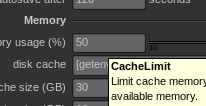
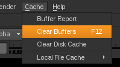

# Nuke Code Snippet

Cette page a pour but de donner des exemples simples des commandes python les plus utilisées dans Nuke

## Preferences

### Modify Nuke preferences

```python
nuke.toNode('preferences')['CacheLimit'].value()
nuke.toNode('preferences')['CacheLimit'].setValue(75)
```

You can get knob name moving cursor on it:



### Modify project preferences

```python
nuke.root()['first_frame'].value() # return frame number
nuke.root()['first_frame'].setValue(101)
```

### Image formats

Image format contain image resolution and pixel size.

#### Get avaible image formats

```python
nuke.formats()
```

#### Modify project image format

```python
nuke.root()['format'].value().name() # return image format name
nuke.root()['format'].value().setName("formatName")
```

#### And some other options

```python
nuke.root()['format'].value().width()
nuke.root()['format'].value().height()
```

#### Get image format of a node

```python
nodeFormat = myNode.format()
nodeFormat.name()
nodeFormat.width()
nodeFormat.height()
```

### Echo python commands (ala Maya)

Go to:
* Edit/Preferences
* _Script Editor_ tab
* Tick _echo python commands to output window_

## Nodes

See [Node class documentation](http://docs.thefoundry.co.uk/nuke/63/pythonreference/nuke.Node-class.html) for more informations.

### Create a node

There is two methods to do the same thing:

```python
nuke.createNode("Blur")
nuke.nodes.Blur()
```

From [official documentation](http://docs.thefoundry.co.uk/nuke/63/pythondevguide/basics.html#creating-nodes-and-setting-their-controls):
* First method create a node the same way the user would do. Using the current _context_. Example: If a node is selected, the new created node will be connected to the first one, its panel will be displayed, etc.
* Second method crete a _floating_ node, without connection of particular trigger, just a node.

#### Don't open panel for the created node

```python
nuke.createNode("Blur", inpanel=False )
```

#### Set some knob at creation time

```python
nuke.nodes.Blur(size=10)
```

### Remove a node

```python
nuke.delete(myNode)
```

### Selection

Because of its [complex behavior](http://www.nukepedia.com/reference/Python/nuke-module.html#selectedNode), avoid:

```python
nuke.selectedNode()
```

Use this instead:

```python
nuke.selectedNodes()
```

It return a list in the reversed selection order.

#### Ask if a node is selected

```python
myNode.isSelected() # True/False
```

#### Add/Remove a node from the selection

```python
myNode.setSelected(True)
```

### In the project

#### Get all nodes

```python
nuke.allNodes()       # list all current project nodes
nuke.allNodes("Blur") # list all nodes of class Blur of the current project
```

#### Get a node from its name

```python
nuke.toNode("Blur1")
```

#### Get node name

```python
myNode.name() # return node name "Blur1"
myNode.fullName() # return complete node name
```

#### Get node graph position

```python
myNode.xpos()
myNode.ypos()
myNode.setXpos(30)
myNode.setYpos(30)
```

### Node parameters

#### List node attribute dicts

```python
myNode.knobs()
```

#### Get/Set node variables

```python
myNode.knob("size").value()     # get value
myNode.knob("size").setValue(2) # set value
````

Another method:

```python
myNode["translate"].value()                    # get value [2.0, 0.0, 32.0]
myNode["translate"].setValue([1.0, 0.0, 16.0]) # set array value
```

#### Add a parameter to a node

```python
myControl = nuke.Array_Knob("name", "label") # "name" is the knob name and "label" is what will be displayed in the UI (optional).
myControl.setTooltip('Mon tooltip') # Add a tooltip to the knob
myNode.addKnob(myControl)
```

#### Knob types

[Official documentation](https://www.thefoundry.co.uk/products/nuke/developers/63/ndkdevguide/knobs-and-handles/knobtypes.html) with images.

```python
textControl = nuke.Text_Knob("divider") # A simple separation line
colorControl = nuke.Color_Knob("color") # A color knob
doubleControl = nuke.Double_Knob("value") # A floatting value knob
sliderControl = nuke.WH_Knob("value") # A slider
myNode.addKnob(textControl)
myNode.addKnob(colorControl)
myNode.addKnob(doubleControl)
myNode.addKnob(sliderControl)
```

A button executing Python code:

```python
pyButton = nuke.PyScript_Knob("Do something")
pyButton.setCommand("print 'Toto'")
myNode.addKnob(pyButton)
```

Other type of knobs are avaible if inherited class of [Knob class](http://docs.thefoundry.co.uk/nuke/63/pythonreference/nuke.Knob-class.html).

Some parameters can be _executed_ (as if you would click on the button):

```python
for myNode in nuke.allNodes("Read") :
    myNode["reload"].execute()
```

### Node connections

All connections are made using inputs/outputs:

```python
myNode.minInputs() # 3 for a merge node: A, B, et Mask
myNode.maxInputs() # 101 for a merge node: A2, B2, etc...
myNode.maxOutputs() # Number of outputs (often a single one). Notice it's not the number of time the output is used.
myNode.optionalInput() # Input optional index (often Mask). 2 for a merge node.
```

Inputs array size:

```python
myNode.inputs()
```

* If Mask (index 2) is connected, this size is 3 (0,1,2).
* If A is connected, size is... 2 (0,1). (Looks like A is the second item of the array and B is the first...).
* If B is connected, size is... 1 (just one index: 0).

```python
myNode.canSetInput(0, anotherNode)   # check the connection of anotherNode to myNode on index 0 is possible
myNode.setInput(0, anotherNode)      # connect a node to another on index 0 (myNode take anotherNode in input, anotherNode get connected to myNode)
myNode.setInput(0, None)             # disconnect an input
myNode.connectInput(0, anotherNode)  # connect anotherNode output to index 0 of myNode input
myNode.channels()                    # ['rgba.red', 'rgba.green', 'rgba.blue', 'rgba.alpha', 'depth.Z']
```

#### List upstream/downstream dependencies

```python
myNode.dependent()    # return list of node depending of myNode
myNode.dependencies() # return a list of node which myNode depends on
```

### Metadats

Get metadatas:

```python
node = nuke.toNode("Read1")
print node.metadata() # a dict of metadata

# Result:
{'exr/displayWindow': [0, 0, 2047, 1555], 'input/width': 2048, 'exr/nuke/camera/vaperture': '18.672', 'input/bitsperchannel': '16-bit half float'...
```

Source: [Reading Metadata](http://docs.thefoundry.co.uk/nuke/63/pythondevguide/metadata.html).

### Node label

We can modify node's label (name displayed in the UI) with a specific syntax:

```tcl
[ lindex [split [filename] /] end-1] # le nom du dossier qui contient l'image ("p099" si "s002/p099/diffuse.0001.exr")
[ lindex [split [filename] /] end-2][ lindex [split [filename] /] end-1] # Variante du dessus ("s002p099" si "s002/p099/diffuse.0001.exr")
[ lindex [split [lindex [split [knob [topnode].file] .] 0] /] end] # Le nom du fichier sans l'extension
[date %d]/[date %m]/[date %y] # Affiche la date de l'image
```

The language used is [tcl](http://tmml.sourceforge.net/doc/tcl/).

Other useful commands are avaible here: [Value vs knob command](http://www.nukepedia.com/tcl/value-vs-knob-command/)

## Animation


#### Get animation value for a given frame, for a given view

```python
myNode["translate"].valueAt(25, view='R')
# Result: [-26.308155060000001, 2.3234429360000002, 72.413200380000006]
```

We can add array index (here: 0):

```python
myNode["translate"].valueAt(25, 0, view='R')
# Result: -26.308155060000001
```

## UI

Interesting URL:
* NUKE Python Developers Guide v6.3v1 documentation: [Customizing the UI](http://docs.thefoundry.co.uk/nuke/63/pythondevguide/custom_ui.html)

### Menus


#### Customize menu

```python
menuBar = nuke.menu("Nuke") # main menu
myMenu = menuBar.addMenu("&myMenu") # add a custom menu
myMenuCommand = myMenu.addCommand("Do Something", "doSomething()") # add a command

mySubMenu = myMenu.addMenu("mySubMenu") # add a sub-menu to our custom menu
mySubMenu.addCommand("Do Something", "doSomething()") # add a command

editMenu = menuBar.findItem("&Edit") # look for an existing menu
editMenu.addCommand("Do Something", "doSomething()") # and add a command on it
nodeSubMenu = editMenu.findItem("Node") # look for the "Node" sub-menu
nodeSubMenu.addSeparator() # add a separator to it
nodeSubMenu.addCommand("Do Something", "doSomething()") # and a command
```

### Dialog

#### A fileDialog, for clips. One/multiple files

```python
nuke.getClipname( "fileDialogName" )
# Result: '/path/to/my/file'
nuke.getClipname( "fileDialogName", multiple=True )
# Result: [/path/to/my/file1', '/path/to/my/file2', '/path/to/my/file3']
```

#### A fileDialog with a pattern and defaultPath

```python
nuke.getFilename("fileDialogName", pattern="*.png;*.jpeg", default="/path/to/a/file" )
```

#### Yes/No dialog

```python
nuke.ask("Are you OK?") # return True/False
```

### Icons

#### Apply an icon to a node

```python
myNode["icon"].setValue("/path/to/an/icon.png")
```

### Others

#### Override creation function of a particular node

```python
def myCreateNode() :
    print "hello"
nukescripts.create_read = myCreateNode
```

#### Disable node thumbnail

I strongly suggest to do this on big scripts.

```python
myNode["postage_stamp"].setValue(False)
```

### PySide

Some code snippets find here and there.

#### A window resting _in front of_ Nuke, even if there is no more focus (ala Maya)

Found on the nuke-python [mailing list](nuke-python@support.thefoundry.co.uk).

```python
from PySide import QtCore, QtGui

class TestWindow(QtGui.QDialog):
    def __init__(self, parent=QtGui.QApplication.activeWindow()):
        QtGui.QDialog.__init__(self, parent)
        self.hbox=QtGui.QHBoxLayout()
        self.button=QtGui.QPushButton("TEST")
        self.hbox.addWidget(self.button)
        self.setLayout(self.hbox)

tw = TestWindow()
tw.show()
```

You can put it _behind_ Nuke replacing:

```python
QtGui.QApplication.activeWindow()
```

By:

```python
QtGui.QApplication.desktop()
```

You must give a parent anyway. Without parent, Nuke will bring you a __Segmentation fault__ when you quit.

## Debug

#### Display plugin path

```python
nuke.pluginPath()
```

#### Get node statistics (performance metrics)

In terminal or GUI mode, Linux only

```bash
nuke -P
```

#### Display every Nuke callbacks in a terminal

In your `.nuke/init.py`, add:

```python
import callbacksTrace
```

#### Get debug information when Nuke free its memory

Run Nuke with `NUKE_DEBUG_MEMORY` setted to `1` (see page 9 [of the documentation](https://thefoundry.s3.amazonaws.com/downloads/Nuke5.2v1_ReleaseNotes.pdf)).

This option is very interesting combined with `-P` flag.

#### Get Nuke backtrace when it crash

You have to get Nuke PID with this command:

```bash
ps aux | grep nuke
```

Then run:

```bash
gdb -p <PID>
```

* `gdb` will initialize then Nuke will freeze.
* Type `continue` to unfreeze Nuke.
* When Nuke crash, `gcb` will block before quitting the application.
* Type  `bt` (or `backtrace`) to get the backtrace and investigate where Nuke crashed.

You will get something like:

```bash
(gdb) c
Continuing.
Program received signal SIGINT, Interrupt.
0x00007f991ca63672 in select () from /lib64/libc.so.6
(gdb) bt
#0  0x00007f991ca63672 in select () from /lib64/libc.so.6
#1  0x0000000001296115 in ?? ()
#2  0x00000000012965bf in ?? ()
#3  0x00000000012976d6 in ?? ()
#4  0x0000000001275457 in ?? ()
#5  0x0000000000714b58 in ?? ()
#6  0x00000000005dabf0 in ?? ()
#7  0x00000000005d846f in ?? ()
#8  0x00000000005d7cbc in ?? ()
#9  0x0000000000b703d8 in ?? ()
#10 0x00007f991a8d2041 in PyEval_EvalFrameEx (f=0x11029010, throwflag=<value optimized out>) at Python/ceval.c:3750
#11 0x00007f991a8d3e91 in PyEval_EvalCodeEx (co=0x20f0b70, globals=<value optimized out>, locals=<value optimized out>, args=0xb, argcount=1, kws=0x10a645d8, kwcount=10, defs=0x2125770, defcount=8, closure=0x0) at Python/ceval.c:3000
#12 0x00007f991a8d2289 in PyEval_EvalFrameEx (f=0x10a64300, throwflag=<value optimized out>) at Python/ceval.c:3846
#13 0x00007f991a8d2780 in PyEval_EvalFrameEx (f=0x21629d0, throwflag=<value optimized out>) at Python/ceval.c:3836
#14 0x00007f991a8d3e91 in PyEval_EvalCodeEx (co=0x2125300, globals=<value optimized out>, locals=<value optimized out>, args=0xe, argcount=0, kws=0x2162870, kwcount=14, defs=0x0, defcount=0, closure=0x0) at Python/ceval.c:3000
#15 0x00007f991a8d2289 in PyEval_EvalFrameEx (f=0x21626f0, throwflag=<value optimized out>) at Python/ceval.c:3846
#16 0x00007f991a8d3e91 in PyEval_EvalCodeEx (co=0x213aaf8, globals=<value optimized out>, locals=<value optimized out>, args=0x0, argcount=0, kws=0x0, kwcount=0, defs=0x0, defcount=0, closure=0x0) at Python/ceval.c:3000
#17 0x00007f991a8d4182 in PyEval_EvalCode (co=0x7, globals=0x1da48e8, locals=0x1da4b80) at Python/ceval.c:541
#18 0x00007f991a8f7d51 in PyRun_FileExFlags (fp=0x1ebee90, filename=0x7fffb1933004 "/tmp/InKExe-20111007-61dtGE/nukeRenderer.py", start=<value optimized out>, globals=0x1e07dc0, locals=0x1e07dc0, closeit=1, flags=0x0) at Python/pythonrun.c:1339
#19 0x0000000000b653bc in scriptFile(char const*) ()
#20 0x0000000000b8b202 in ?? ()
#21 0x00007f991c9b5586 in __libc_start_main () from /lib64/libc.so.6
#22 0x00000000004a767a in ?? ()
#23 0x00007fffb1930818 in ?? ()
#24 0x000000000000001c in ?? ()
#25 0x0000000000000006 in ?? ()
```

Here, Nuke crashed on the `select()` function of the `libc.so.6`.

More information on the command here: [Debugging Under Unix: gdb Tutorial](https://www.cs.cmu.edu/~gilpin/tutorial/)

## Some known error messages

Here is a list of error message, their means and solutions.


### "ValueError: not attached to a node"

This message:

```bash
"ValueError: not attached to a node"
```

Often appear when something call a removed node (often upper in the script).


## Miscellaneous

#### Run Nuke in terminal mode (no GUI)

```bash
nuke -t
```

#### Print in the terminal Nuke is run from

By default, every call to the python `print` command is catched by Nuke console. This mean you can't print in the terminal directly, except using this:

```python
nuke.tprint("Hello World!")
```

#### Free cached memory

```python
nuke.memory("free")
```

It's like click on _Clear Buffers F12_:




#### Clear disk cache

```python
nuke.clearDiskCache()
```

It's like click on _Clear Disk Cache_.

#### Known if the script is run in terminal or GUI mode

```python
nuke.GUI
```

#### Get CPU count


```python
nuke.NUM_CPUS
```

For a complete list:

```python
help(nuke)
```
